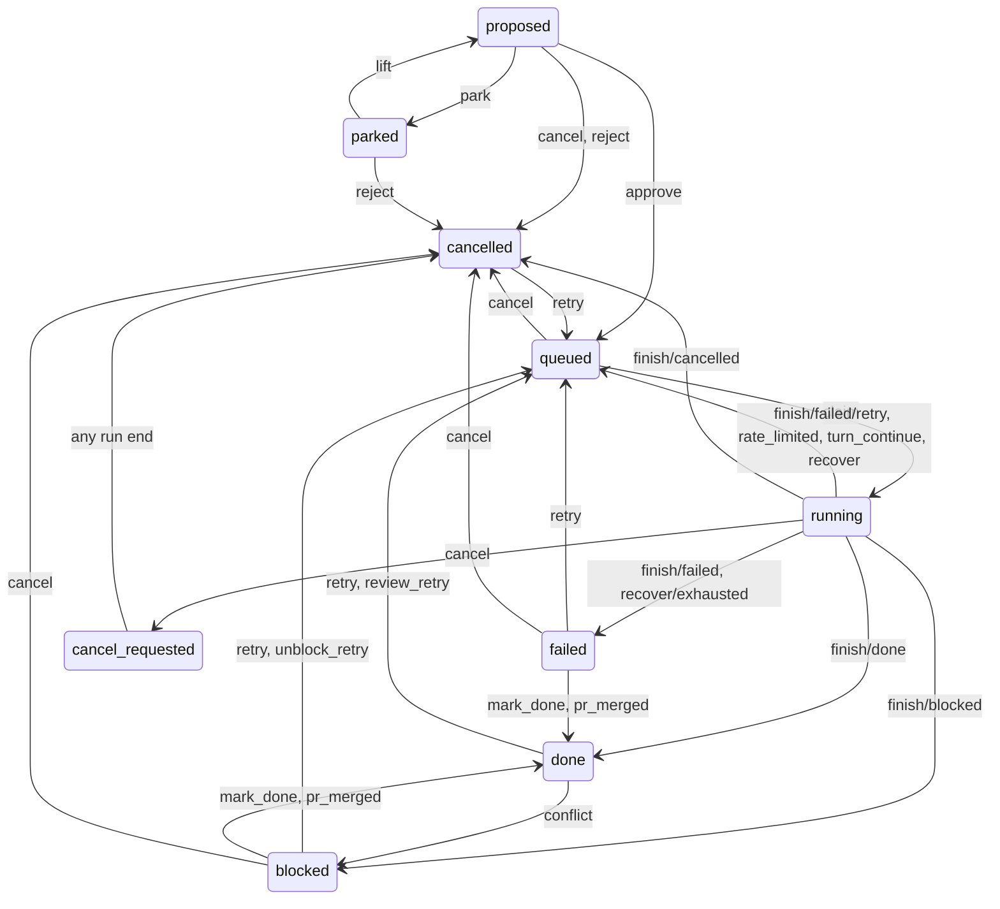

# Task lifecycle

<!-- Generated by `pnpm docs:gen` from the code. Do not edit: `pnpm test` fails when it is stale. -->

Every status change a task can make, and the events that cause it.

```mermaid
stateDiagram-v2
  proposed --> parked: park
  proposed --> queued: approve
  proposed --> cancelled: cancel, reject
  parked --> proposed: lift
  parked --> cancelled: reject
  queued --> running: claim
  queued --> cancelled: cancel
  running --> queued: finish/failed/retry, rate_limited, turn_continue, recover
  running --> done: finish/done
  running --> blocked: finish/blocked
  running --> failed: finish/failed, recover/exhausted
  running --> cancel_requested: cancel
  running --> cancelled: finish/cancelled
  done --> queued: retry, review_retry
  done --> blocked: conflict
  blocked --> queued: retry, unblock_retry
  blocked --> done: mark_done, pr_merged
  blocked --> cancelled: cancel
  failed --> queued: retry
  failed --> done: mark_done, pr_merged
  failed --> cancelled: cancel
  cancel_requested --> cancelled: any run end
  cancelled --> queued: retry
```
